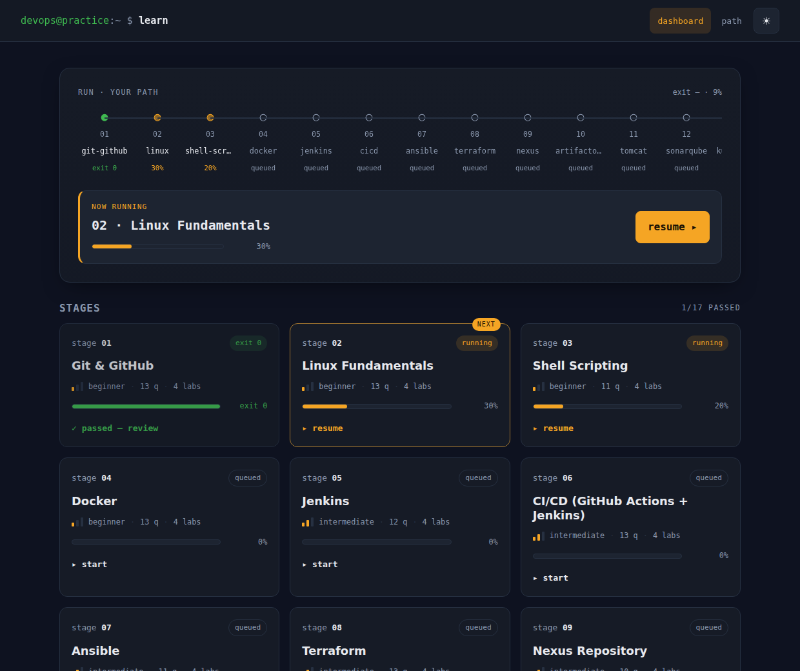
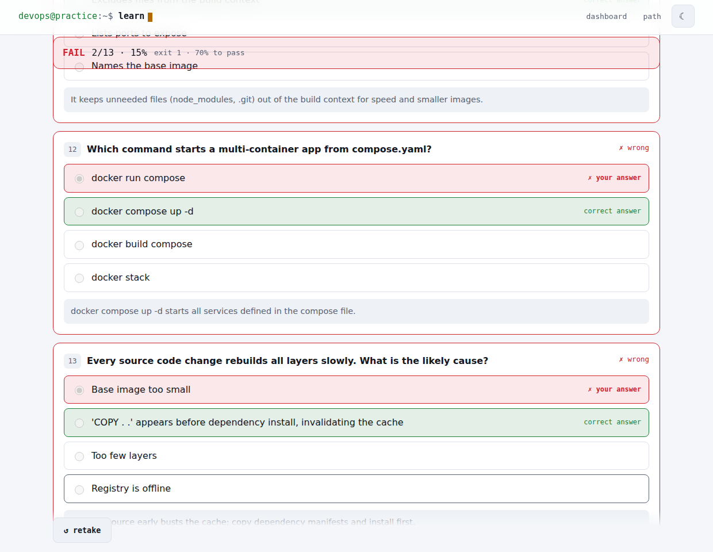
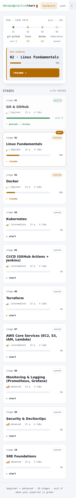

# DevOps Practice Platform

An interactive, full-stack learning platform that teaches 17 core DevOps tools
through **concept notes, cheat sheets, quizzes, and hands-on labs**, with
**per-module progress tracking** along a structured beginner → advanced path.

> Part of the `aws-projects` repository. This app is self-contained under
> `devops-practice-platform/` and does not touch the existing AWS project docs.



## Design — "control plane, after dark"

The UI is themed around the world its learners live in. Your path is rendered
as a **live CI/CD pipeline run**: the seventeen modules are stages that move from
`queued (○)` → `running (◍)` → `passed (●)`, and finishing a module is an
`exit 0`. A "now running" panel re-attaches you to your current stage.

- **Type:** IBM Plex Mono for the terminal/label voice, IBM Plex Sans for body.
- **Color:** a warm blue-graphite field with an amber "running" accent; green
  and red are reserved for pass/fail status only. Difficulty is a 1–3
  signal-bar meter, never a traffic light.
- **Themes:** light and dark (respects `prefers-color-scheme`, with a toggle).
- **Accessible:** correctness shown as icon **and** text (not colour alone),
  status announced to screen readers, visible focus rings, 44px targets, and
  reduced-motion honored.

| Graded quiz | Mobile |
|-------------|--------|
|  |  |

## What's inside

| Layer      | Tech                        | Location   |
|------------|-----------------------------|------------|
| Frontend   | React 18 + Vite + React Router | `web/`   |
| Backend    | Node.js + Express (REST API)   | `server/` |
| Database   | PostgreSQL                     | `server/src/db/` |
| Content    | 17 authored modules as JSON    | `content/` |
| Docs       | System design & API contract   | `docs/`   |

## Modules (beginner → advanced)

1. Git & GitHub · 2. Linux Fundamentals · 3. Shell Scripting · 4. Docker ·
5. Jenkins · 6. CI/CD (GitHub Actions + Jenkins) · 7. Ansible · 8. Terraform ·
9. Nexus Repository · 10. JFrog Artifactory · 11. Apache Tomcat · 12. SonarQube ·
13. Kubernetes · 14. AWS Core (EC2, S3, IAM, Lambda) ·
15. Monitoring & Logging (Prometheus, Grafana) · 16. Security & DevSecOps ·
17. SRE Foundations

Each module ships with a concept overview, a notes/cheat-sheet section, **10–15
quiz questions** (multiple-choice, true/false, and scenario-based, each with an
explanation), and **4 hands-on labs** (beginner, intermediate, advanced, and a
real-world simulation).

## Quick start

### Option A — Docker Compose (one command)

```bash
cd devops-practice-platform
cp .env.example .env          # optional; sensible defaults are baked in
docker compose up --build
```

- Web UI → http://localhost:8080
- API    → http://localhost:4000/api
- The API container runs migrations and seeds all 17 modules automatically.

For a detailed, step-by-step Docker walkthrough (prerequisites, verification,
and troubleshooting), see [`docs/DOCKER_SETUP.md`](docs/DOCKER_SETUP.md).

### Option B — Run locally

Prerequisites: Node.js 18+ and a running PostgreSQL.

```bash
# 1. Create the database (example)
createdb devops_platform

# 2. Backend
cd devops-practice-platform/server
cp ../.env.example .env        # then edit DATABASE_URL if needed
npm install
npm run setup                  # migrate + seed all modules
npm start                      # API on :4000

# 3. Frontend (new terminal)
cd devops-practice-platform/web
npm install
npm run dev                    # SPA on :5173 (proxies /api to :4000)
```

Open http://localhost:5173.

## How progress works

A module's completion percent is a weighted sum:

| Activity            | Weight | Completion criteria                     |
|---------------------|:------:|-----------------------------------------|
| Notes read          | 20%    | User marks the notes as read            |
| Quiz passed         | 40%    | Score ≥ 70%; scaled by best score       |
| Hands-on labs       | 40%    | Each of the 4 labs contributes 10%      |

A module is **complete at 100%**. Overall path progress is the average of all
module percents. Progress is stored per learner in the `progress` table. See
`server/src/services/progress.js` for the exact (unit-tested) logic and
`docs/SYSTEM_DESIGN.md` for the JSON structures.

## Users / auth

To stay zero-setup, there is no login. The browser generates a stable learner
id stored in `localStorage` and sent as the `x-user-id` header; the API lazily
creates a user row for it. This is the single seam to replace with real
authentication — see `server/src/middleware/user.js`.

## API summary

| Method | Path                               | Purpose                          |
|--------|------------------------------------|----------------------------------|
| GET    | `/api/health`                      | Liveness + DB check              |
| GET    | `/api/modules`                     | List modules + per-user percent  |
| GET    | `/api/modules/:slug`               | Concept + notes + progress       |
| GET    | `/api/modules/:slug/quiz`          | Quiz questions (answers hidden)  |
| POST   | `/api/modules/:slug/quiz/submit`   | Grade answers, update progress   |
| GET    | `/api/modules/:slug/tasks`         | Hands-on labs + completion flags |
| GET    | `/api/progress`                    | All module progress for the user |
| POST   | `/api/progress/:slug`              | Mark notes read / (un)complete a lab |

Full request/response shapes are documented in
[`docs/SYSTEM_DESIGN.md`](docs/SYSTEM_DESIGN.md).

## Adding or editing content

All module content lives in `content/<slug>.json` (one file per module) and is
the single source of truth. Edit or add a file, then re-seed:

```bash
cd server && npm run seed
```

The seed script validates structure implicitly (it fails loudly on bad JSON)
and reloads every module transactionally.

## Repository layout

```
devops-practice-platform/
├── content/            # 17 authored module JSON files (source of truth)
├── server/             # Express API, DB schema, seed, progress logic
│   └── src/{db,routes,middleware,services}
├── web/                # React + Vite SPA
│   └── src/{pages,components,api,styles}
├── docs/SYSTEM_DESIGN.md
├── docker-compose.yml
└── README.md
```
